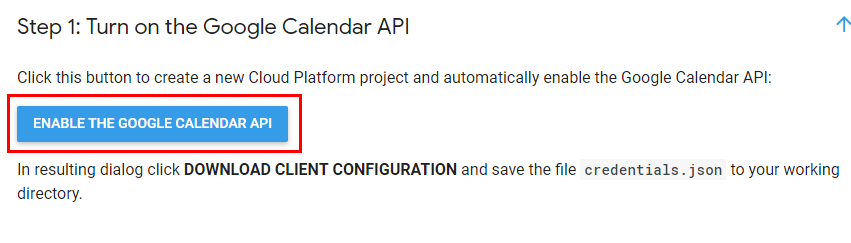
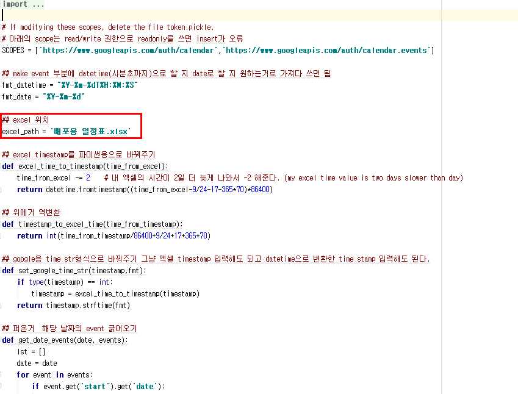
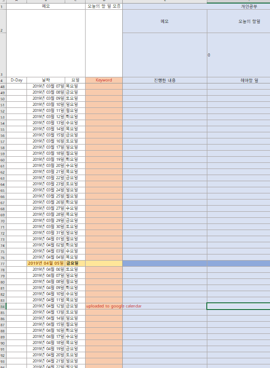

# Excel to Google Calendar
- This program can insert to-do list in excel to google calendar.
- Program comments are written in Korean.

## 1.Get your credentials.json from [google calendar api]( https://developers.google.com/calendar/quickstart/python)

follow Step 1 and put credentials.json in the project folder

<p align="center"></p>

<p align="left"></p>

## 2. Install following libraries by using pip

```
pip install --upgrade google-api-python-client google-auth-httplib2 google-auth-oauthlib pandas
```

## 3. Fix excel_path then run excel_to_calendar_v1 to create token.pickle

<p align="left"></p>

## 4. Fill your to-do list in excel files then run excel_to_calendar_v1 to add list to google calendar

Fix the path of excel_path

<p align="left"></p>

Fill your to do list after today. if you want add all of do list, fix the code where the line comparing with today's timestamp

<p align="left"></p>